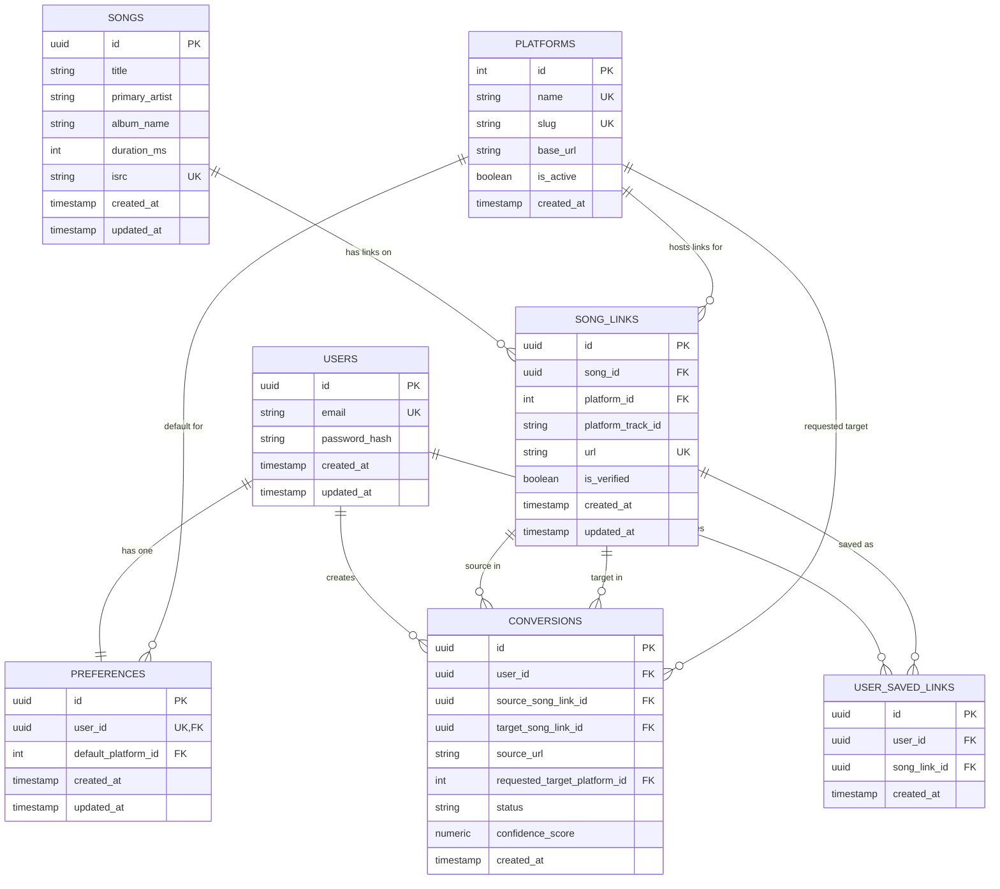

# Universal Music Link ERD

This ERD reflects the current relational schema defined in `server/db/schema.sql`.

## Constraint Notes

- `preferences.user_id` is unique (one preference row per user).
- `song_links.url` is unique.
- `song_links` has composite unique key: `(song_id, platform_id)`.
- `user_saved_links` has composite unique key: `(user_id, song_link_id)`.
